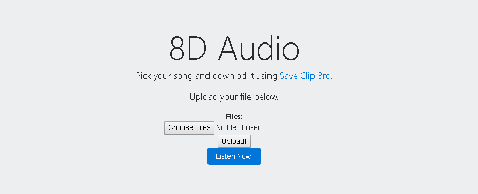

# binary_audio  

The inspiration for this project came from a series of YouTube videos I was
shown, called [8D Audio](https://www.youtube.com/channel/UCrRpYEytIHGyDgNWO6VbHlQ/videos "Check it out!").  
Yeah, the name doesn't make a ton of sense, but anyways, I thought this was pretty neat. I think it would be cool to try and make a series of signal processing methods to make any song "8D Audio". This is what it looks like so far.

## Getting Started  
The dependancies required to run the script are in `requirments.txt`.  This was built using python 3.7.0 and pip 18.1, you can install the dependancies with the command  
`pip install -r requirements.txt`  
To add effects chains to the songs such as reverb, you need [SoX](http://sox.sourceforge.net/) installed on your computer.  If pysox, the wrapper class for SoX doesn't recognize SoX, make sure you add SoX to PATH in enviorment variables.  

`audio_features.py` is best used for when devoloping the signal processing. This script was devoloped by taking files in the first directory and saves them in the seccond.  
* ./binary_audio/sample_audio
* ./binary_audio/static

To run the flask app locally, `python app.py`.
I have added an example file, it is a youtube not copy right song.  You can play with what I have started by dropping a wav file in sample_audio, or use the exapmple, and running `audio_features.py` or uploading in the flask app.  The result will be in sample_output or on the listening page.  To download another wav file to experiment with, you can use this site, [Save Clip Bro](https://www.saveclipbro.com/).

## What needs to be done   
Currently, audio moves on horizontal plane with effects chain and is pretty close to achieving "8D" status.  The other properties I have noticed in this format of audio conversion that need to be introduced are  

* Left and right channel swapping to match song breakpoints (currently matches tempo)
* Audio elevation swapping (varrying high and low pass filters)
* Tune reverb and add additional effects using sox transformer
* Make a nice looking UI
