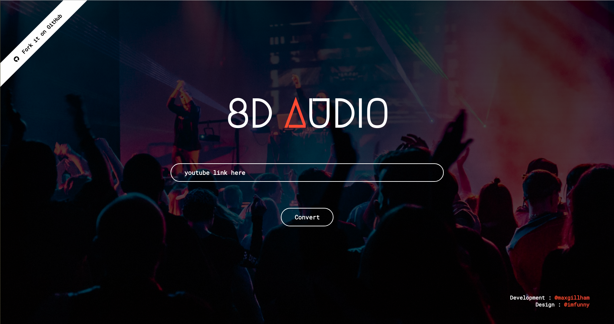

# 8D Audio
## Try it out at www.8daudio.ca
The inspiration for this project came from a series of YouTube videos I was
shown, called [8D Audio](https://www.youtube.com/channel/UCrRpYEytIHGyDgNWO6VbHlQ/videos "Check it out!").  
Yeah, the name doesn't make a ton of sense, but anyways, I thought this was pretty neat. I think it would be cool to try and make a series of signal processing methods to make any song "8D Audio". This is what it looks like so far.

## Getting Started  
The dependancies required to run the script are in `requirments.txt`.  This was built using python 3.6.5, you can install the dependancies with the command  
`pip install -r requirements.txt`  
To add effects chains to the songs such as reverb, you need [SoX](http://sox.sourceforge.net/) installed on your computer. If you are on Windows, make sure you add SoX to PATH in enviorment variables. The web app also now has the funcitonality to download a song from youtube given a link. In order for this to run locally, you may also need ffprobe or avprobe. I use ffprobe, you can download it [here](https://www.ffmpeg.org/download.html).  
The system architecture is as follows.  
* `app.py` 
  * This is the main script to launch the flask app
* `audio_features.py`
  * This is the method containing all of the digital signal processing
* `templates/.`
  * Webpage to be rendered
* `static/`
  * Folder used by flask to serve up `index.js` and `index.css` to webpage
* `out/`
  * A temp folder for storing audio files 
To run the flask app locally, `python app.py`.  

## What needs to be done   
Currently, audio moves on horizontal plane and vertical plane with effects chain and is pretty close to achieving "8D" status.  Some other things I am wanting to approve:

* Reduce loss in audio reconstruction from ifft when applying high and low pass filters

